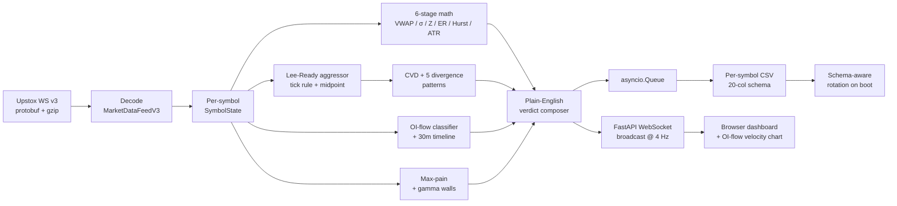

# GammaLeak

> **Real-time market-data streaming platform** — protobuf WebSocket decode, per-symbol async logging, layered signal-derivation engine, and a 4 Hz browser dashboard for Indian F&O microstructure on the Upstox v3 feed.


---

## TL;DR

| Aspect | Detail |
|---|---|
| **Domain** | Live tick stream from Upstox WebSocket v3 — NIFTY 50, BANKNIFTY, NIFTY/BN front-month futures, USDINR FUT, CRUDEOIL FUT, India VIX, plus equity drivers (RELIANCE, HDFCBANK, SBIN, ICICIBANK) and a dynamic NIFTY option-chain window |
| **Scale** | ~500 k+ ticks per session across 8 core instruments + dynamic option strikes, sustained 50–200 ticks/s, 200+ during bursts |
| **Codebase** | ~8,300 lines Python across `GammaLeak.py` (3,746) + 6 packages (`core`, `ui`, `orderflow`, `signals`, `analytics`, `gammaleak_runtime`) + FastAPI broadcaster (256) + ~2,250 lines vanilla-JS dashboard (`static/index.html` 1,758 + `static/simulation.html` 488) |
| **Pipeline** | gzip → protobuf decode → per-symbol `SymbolState` → 6-stage math + Lee-Ready aggressor → CVD + 5 divergence patterns → English-verdict composer → 4 Hz WebSocket fan-out + per-symbol CSV |
| **Persistence** | 20-column versioned schema, **per-symbol parallel log streams** under `logs/YYYY-MM-DD/<SYMBOL>.csv`, **schema-aware rotation** at boot (legacy files auto-archived), depth-drop-safe order-book extraction |
| **Differentiator** | F&O domain depth — Lee-Ready CVD, OI-flow velocity, max-pain + gamma walls, gamma-flush detection, ATM straddle box, spot↔FUT verdict mirror — layered cleanly on top of streaming-systems engineering |

## What this project demonstrates

- **Streaming systems** — protobuf decode at sustained 50+ ticks/s, `asyncio.Queue` decoupling tick path from disk path, `asyncio.to_thread` batched writes (5 ticks or 1 s), ≤ 250 ms broadcast cycle, WebSocket silence watchdog + reconnect loop.
- **Schema engineering** — versioned 20-column CSV schema; bootloader detects legacy-schema files on disk and archives them with a timestamp suffix before opening fresh streams; no silent corruption across schema bumps.
- **Reliability under live-feed chaos** — exchange depth drops to zero levels gracefully handled with `try/except` around `marketLevel.bidAskQuote[0]`; instrument-master resolver **loud-fails** on missing contracts instead of hardcoding fallbacks; daily expiry rollover handled by a self-healing instrument-master cache.
- **Domain depth** — Lee-Ready aggressor classification (tick rule + midpoint refinement on zero-tick), cumulative volume delta with **pullback-validated** exhaustion detectors (kills gap-day false fires), OI-delta flow classification (NEW LONGS / NEW SHORTS / SHORT COVER / LONG EXIT), max-pain + gamma-wall anchors, spot-to-FUT verdict mirroring so spot cards inherit flow context from the volume-bearing futures leg.
- **Full-stack execution** — async FastAPI backend, vanilla-JS dashboard with anchored OI-flow velocity chart and CSS-driven verdict-priority demotion, OAuth daily-JWT refresh script, Docker compose.

## Architecture



---

## Table of Contents

- [Problem Statement](#problem-statement)
- [System Architecture](#system-architecture)
- [Signal Engine — Phases & Layers](#signal-engine--phases--layers)
- [Package Layout (post-refactor)](#package-layout-post-refactor)
- [Components](#components)
  - [1. GammaLeak Engine (Core)](#1-gammaleak-engine-core)
  - [2. Web Server & Browser Dashboard](#2-web-server--browser-dashboard)
  - [3. FII/DII Scraper](#3-fiidii-scraper)
  - [4. Historical Data Fetcher](#4-historical-data-fetcher)
  - [5. OAuth Token Exchange](#5-oauth-token-exchange)
- [Data Pipeline](#data-pipeline)
- [Instrument Master & Self-Healing Resolver](#instrument-master--self-healing-resolver)
- [Tech Stack](#tech-stack)
- [Project Structure](#project-structure)
- [Setup & Installation](#setup--installation)
- [Usage](#usage)
- [Output & Exports](#output--exports)
- [Methodology Deep Dive](#methodology-deep-dive)
- [Limitations](#limitations)
- [Version History](#version-history)
- [License](#license)

---

## Problem Statement

Discretionary F&O traders monitor 6+ instruments (NIFTY, BANKNIFTY, USDINR, Crude, RELIANCE, HDFCBANK) + options OI + global cues simultaneously. The three pathologies this tool addresses:

1. **Attention overload** — collapse everything into one HUD/dashboard that surfaces the *statistically anomalous* instrument in real time.
2. **Late-tape problem** — after ~10:30 AM the session VWAP becomes "heavy" and micro-flushes stop registering in the session Z-score. Signals arrive *after* the move. The V5.2 Micro-Structural Layer adds a rolling 15-min anchor + Z-velocity + tick-rate + cross-asset acceleration amber to reclaim ~30–90 seconds of early warning.
3. **OI without context** — raw max-pain / PCR snapshots don't show flow. The OI-flow classifier diffs ATM±2 CE/PE OI per tick, labels the quadrant (NEW LONGS / NEW SHORTS / SHORT COVER / LONG EXIT), and feeds an anchored 30-min velocity chart so liquidity sweeps, floor failures, and max-pain magnets become visually inspectable.

---

## System Architecture

```
                                   UPSTOX CLOUD
                   WebSocket v3 (protobuf)  |  REST v2/v3 (JSON)  |  Instrument Master (gz)
                              |                       |                       |
                              v                       v                       v
+-----------------------------+-----------------------+-----------------------+------+
|                         GammaLeak.py  (headless engine)                            |
|                                                                                    |
|  tick decode -> per-symbol state -> 6 math stages -> Phase 1/2/3 state machine     |
|          -> V3 (Gamma Flush) -> V4 (Adaptive Regime) -> V5.2 Micro-Structural      |
|          -> Phase 5 (Lee-Ready + CVD + 5 divergences + verdict composer)           |
|          -> OI-flow classification + max-pain / gamma walls / PCR                  |
|                                                                                    |
|  Packages: core/  ui/  orderflow/  signals/  analytics/  gammaleak_runtime/        |
+------------+-----------------------------+-----------------------------+-----------+
             |                             |                             |
             v                             v                             v
   +---------+----------+        +---------+----------+        +---------+----------+
   | Rich Terminal HUD  |        |  FastAPI + WS      |        | logs/YYYY-MM-DD/   |
   | (ui/terminal.py)   |        |  static/index.html |        |   <SYMBOL>.csv     |
   +--------------------+        |  (browser @4 Hz)   |        | logs/..._events.csv|
                                 |  + simulation.html |        +--------------------+
                                 +--------------------+
```

---

## Signal Engine — Phases & Layers

The engine is an **additive** stack — every new layer was shipped *without* deleting the previous state machine. This is deliberate: the old state machine is the proven safety rail; new layers either inform or pre-alert, never override.

| Layer | What it does | Sig_state effect |
|-------|--------------|------------------|
| **Phase 1** (Math Foundation) | SD floor (0.35% × LTP), Z-Score cap ±12, EWMA VWAP stabilisation | Base |
| **Phase 2** (Signal Logic) | `sig_state` machine `0 → 1 (ALERT) → 2 (CONFIRM)`, thesis TTL + warn/kill, progressive coloring | Primary driver |
| **Phase 3** (Behavioural) | VWAP rejection memory (5-min cooldown), same-side cooldown, opening-range guard | Gates transitions |
| **Institutional Ph 1** | Event-calendar blackout, named setup classifier, conviction score | Annotates `sig_state=2` |
| **Institutional Ph 2** | Cross-asset driver panel (HDFCBANK / RELIANCE → NIFTY; SBIN / ICICIBANK → BANKNIFTY) | Suppression gate |
| **Institutional Ph 3** | OI Levels panel (Max-Pain, Gamma Walls, PCR) — `orderflow/oi_levels.py` | Contextual |
| **V3.0** (Gamma Flush) | `orderflow/gamma.py` — IV spike + Gamma expansion + sell-side > 65% on ATM±100 | Forces flush signal |
| **V4.0** (Adaptive Regime) | `signals/regimes.py` — classifies `THE_PIN / EXPANSION / GAMMA_SQUEEZE`; also fans OI-flow classification per NIFTY tick | Dynamic threshold |
| **V5.1** | Per-strike OI Δ flow classification (NEW LONGS / NEW SHORTS / SHORT COVER / LONG EXIT) — `orderflow/oi_flow.py` | Option-chain context |
| **V5.2** (Micro-Structural) | `signals/momentum.py` — 4 additive early-warning layers (below) — display-only amber tier | **Does NOT touch `sig_state`** |
| **Phase 5** (Order-Flow + English Verdict) | `orderflow/aggressor.py` — Lee-Ready aggressor on FUT legs → CVD → 5 divergence patterns (BUYER_EXHAUSTION / SELLER_EXHAUSTION / BREAKOUT_CONFIRMED / BUY_ABSORPTION / SELL_ABSORPTION) with pullback validation; `signals/verdicts.py` — plain-English composer (`FADE THE EXTREME`, `RIDE THE BREAKOUT`, `STAND ASIDE`, …) with confidence tier; spot→FUT verdict mirror | Display tier — drives the dashboard's primary verdict label; underlying state machine unchanged |

### V5.2 Micro-Structural Layer

| # | Layer | Parameter | Purpose |
|---|-------|-----------|---------|
| 1 | **Rolling 15-min Micro-Z** | 900 s window, ≥30 ticks, SD floor = 15% × ATR | De-anchors from heavy session VWAP; catches post-10:30 flushes session Z misses |
| 2 | **Z-velocity amber** | dZ/dt over 30 s ≥ 0.05/s, armed in `0.7 ≤ |Z| < 2.0` | Pre-alert tier *below* `sig_state=1` — fires ~15–45 s before the state machine trips |
| 3 | **Tick-arrival-rate spike** | 10 s short rate ≥ 2× 10-min baseline, min 0.5 Hz | "Something is happening right now" — advisory ⚡ chip |
| 4 | **Driver acceleration amber** | HDFCBANK/RELIANCE dZ/dt ≥ 0.06/s propagates to NIFTY while `|NIFTY Z| < 1.5` and `sig_state = 0` | Front-run the lead-lag (large-cap flow leads NIFTY by 5–20 s) |

All four layers **only paint UI chips** (`AMBER ↑/↓`, `μZ`, `⚡ BURST`) — the hard sig_state machine is untouched.

---

## Package Layout (post-refactor)

The original monolith was split into six packages. Public names continue to resolve through `GammaLeak.py`'s re-exports, so existing imports keep working unchanged.

| Package | Modules | Responsibility |
| --- | --- | --- |
| `core/` | `config.py` (349), `models.py` (310), `state.py` (70) | Constants, dataclass shapes (`SymbolState`, `TickData`, `OILevels`, `OIWall`), runtime registries (`symbol_states`, `pcr_state`, `oi_levels_state`, `oi_flow_timeline`) |
| `ui/` | `serializers.py` (459), `terminal.py` (446) | Builds the WebSocket JSON payload consumed by `static/index.html`; Rich-based terminal HUD renderer |
| `orderflow/` | `aggressor.py` (191), `gamma.py` (76), `oi_chain.py` (263), `oi_flow.py` (127), `oi_levels.py` (127) | Lee-Ready + CVD + divergences; gamma-flush; option-chain processing; OI-delta flow classification + 30-min timeline; max-pain + gamma walls |
| `signals/` | `verdicts.py` (135), `exhaustion.py` (77), `momentum.py` (176), `regimes.py` (94) | English verdict composer; sig_state lifecycle + thesis decay; V5.2 micro-structural layer; V4.0 adaptive regime classifier |
| `analytics/` | `math_stats.py` (79), `global_indices.py` (155) | Kaufman ER + R/S Hurst (pure numpy); batched Upstox `/v3/market-quote/ltp` poller for global indices (GIFT NIFTY, Dow, S&P, Nasdaq, FTSE, Asia) |
| `gammaleak_runtime/` | `io_logs.py` (177) | Per-symbol CSV writer + async disk-writer task + schema-aware boot-time rotation |

---

## Components

### 1. GammaLeak Engine (Core)

**File:** `GammaLeak.py` (3,746 lines) — the orchestrator. Two entry points:

```bash
python GammaLeak.py                   # Rich terminal HUD
python web_server.py                  # Headless engine + browser dashboard
```

**Instruments monitored:**

| Instrument | Exchange Key | Feed |
|------------|--------------|------|
| NIFTY 50 | `NSE_INDEX|Nifty 50` | Spot index |
| BANKNIFTY | `NSE_INDEX|Nifty Bank` | Spot index |
| NIFTY FUT (front-month) | `NSE_FO|NIFTY{expiry}FUT` | Index future |
| BANKNIFTY FUT (front-month) | `NSE_FO|BANKNIFTY{expiry}FUT` | Index future |
| India VIX | `NSE_INDEX|India VIX` | Volatility index |
| RELIANCE | `NSE_EQ|RELIANCE` | Equity spot driver |
| HDFC Bank | `NSE_EQ|HDFCBANK` | Equity spot driver |
| SBIN, ICICIBANK | `NSE_EQ|...` | Driver panel |
| USDINR FUT | `NSE_FO|USDINR{expiry}FUT` | Currency future |
| Crude Oil FUT | `MCX_FO|CRUDEOIL{expiry}FUT` | Commodity future |
| NIFTY option chain — ATM ± dynamic window | `NSE_FO|NIFTY{expiry}{strike}{CE/PE}` | Option strikes |

**Math Pipeline (6 stages):**

| Stage | Metric | Formula |
|-------|--------|---------|
| 1 | VWAP | `cumsum(price × vol) / cumsum(vol)` (session) |
| 2 | Rolling StdDev | 60 s rolling window (Phase 1 SD floor) |
| 3 | Z-Score | `(LTP − VWAP) / σ`, capped at ±12 |
| 4 | Efficiency Ratio | Kaufman `|net| / Σ|Δ|` over 15 min |
| 5 | Hurst Exponent | Rescaled-Range (R/S) on tick deque, recomputed every 5 s |
| 6 | VWAP Slope | Linear regression on VWAP window |

**Extras wired into the engine:**

- ATR from OHLC buckets (5-min) → drives V4 threshold scaling + V5.2 SD floor
- Straddle-box tracker (ATM CE+PE), PCR ±10 strikes with dynamic strike-window tracking
- Event-calendar blackout (RBI / CPI / Fed / budget windows)
- Named setup classifier (`PIN_FADE`, `BREAKOUT_CONTINUATION`, etc.) on confirmed entries
- Conviction score (0–100) per confirmed entry
- OI-flow timeline ring buffer (30 min, sampled per second) feeding the anchored velocity chart
- Post-market replay (`--review YYYY-MM-DD`) that re-classifies every Z-signal in the day's CSVs as `REVERTED` / `CONTINUED`

**Logs written per session (current schema):**

- `logs/YYYY-MM-DD/<SYMBOL>.csv` — **one file per instrument**, every tick, 20-col schema
- `logs/YYYY-MM-DD/<SYMBOL>.<archived-timestamp>.csv` — auto-archived legacy-schema file (if schema bumped since last session)
- `logs/YYYY-MM-DD_events.csv` — discrete alert / confirm / kill / divergence events

Columns: `timestamp, symbol, ltp, vwap, std_dev, z_score, signal, er, hurst, regime, volume, oi, book_imb, gap_pct, gap_bucket, verdict, cvd, min_buy, min_sell, divergence`. Per-symbol layout enables single-instrument backtests without filtering hundreds of thousands of mixed rows.

### 2. Web Server & Browser Dashboard

**Files:** `web_server.py` (256 lines), `static/index.html` (1,758 lines), `static/simulation.html` (488 lines)

`web_server.py` runs the entire GammaLeak engine **headless** inside a FastAPI process and broadcasts the full dashboard state over a WebSocket at **4 Hz**. State serialization is delegated to `ui/serializers.py` (`build_state_payload`). The single-file frontend (`static/index.html`) renders:

- Per-instrument cards with LTP, Z, μZ (V5.2 Micro-Z), ER, Hurst, ATR, sig_state badge, plain-English verdict
- **Amber border + chip** when V5.2 amber fires (left border colored by direction)
- **⚡ BURST chip** when tick-rate spike fires (tooltip shows short/baseline rates)
- **Driver amber** on NIFTY card with source name (HDFCBANK / RELIANCE) + velocity
- Index driver panel, OI Levels panel (Max-Pain, Gamma Walls, PCR), Global Indices snapshot (GIFT NIFTY, US, Europe, Asia)
- **Anchored OI-flow velocity chart** — plots spot/FUT against PE/CE walls + max pain + PE/CE OI delta velocity so liquidity sweeps, floor failures, and basis-led breakdowns become visually inspectable

`static/simulation.html` is a standalone OI-flow chart renderer used during dashboard styling iteration.

```bash
python web_server.py                     # default 0.0.0.0:8080
python web_server.py --port 3000         # custom port
python web_server.py --mock              # no Upstox token needed (synthetic ticks)
```

Both renderers (Rich HUD + browser) consume the same `symbol_states` dict — engine logic is never duplicated.

### 3. FII/DII Scraper

**File:** `fii_dii_scraper.py` (588 lines)

Downloads NSE's daily F&O participant-wise OI CSV (`fao_participant_oi_DDMMYYYY.csv`) and extracts FII + DII long/short index & stock futures + options positioning. Standalone (pre-market check) or imported into GammaLeak for live suppression of fade signals that contradict strong directional FII positioning.

```bash
python fii_dii_scraper.py                 # today's snapshot
python fii_dii_scraper.py --date 2026-04-07
python fii_dii_scraper.py --days 5        # last 5 trading days
```

### 4. Historical Data Fetcher

**File:** `fetch_historical.py` (154 lines)

CLI utility for downloading OHLCV candles from Upstox REST v2.

```bash
python fetch_historical.py --symbol NIFTY --interval day --from 2026-01-01 --to 2026-04-09
python fetch_historical.py --key "MCX_FO|CRUDEOIL26MAYFUT" --interval 1minute --date 2026-04-20
```

Supports `1minute`, `30minute`, `day`, `week`, `month` intervals. Saves to `historical/` as CSV.

### 5. OAuth Token Exchange

**File:** `oauth_token_exchange.py` (204 lines)

Handles Upstox's daily OAuth2 token refresh (JWT expires every 24 h). Opens browser → accepts callback code → exchanges for fresh access token → updates `.env` automatically. Run once every morning before market open.

---

## Data Pipeline

### WebSocket Pipeline (live)

```
Upstox WS v3 (protobuf + gzip)
    -> gzip decompress -> protobuf decode (MarketDataFeedV3_pb2)
    -> per-symbol SymbolState update (VWAP, σ, Z, ER, Hurst, Micro-Z, Z-Vel, Tick-Rate, ATR)
    -> regimes.classify_dynamic_regime  (also fans oi_flow + oi_flow_timeline)
    -> orderflow.aggressor.classify + CVD + divergence detectors
    -> signals.verdicts.compose_verdict  (English label + confidence tier)
    -> Phase 2 sig_state machine + V5.2 amber evaluation
    -> ui.terminal (4 FPS) | ui.serializers -> FastAPI WS broadcast (4 Hz)
    -> asyncio.Queue -> disk_writer_task (asyncio.to_thread batch every 5 ticks / 1 s)
    -> logs/YYYY-MM-DD/<SYMBOL>.csv  +  logs/YYYY-MM-DD_events.csv
```

- Binary protobuf (not JSON) — decode cost ~3–6× lower at sustained tick rates.
- `asyncio.Queue` decouples tick processing from disk I/O.
- Disk writes offloaded via `asyncio.to_thread()` — event loop never blocks.
- WebSocket silence watchdog: if no message arrives during market hours for `WS_TICK_TIMEOUT_SECS` (30 s), the engine force-reconnects.

### REST Pipeline (auxiliary)

- Global indices: batched `/v3/market-quote/ltp` poll via `analytics/global_indices.py`.
- Historical OHLCV: 30-day chunked GETs against Upstox REST v2; pipeline auto-chunks and concatenates.
- Rate limiting: 0.3 s delay, 1 s back-off on HTTP 429. SSL: custom context for Windows certificate chain.

---

## Instrument Master & Self-Healing Resolver

Upstox exposes a daily-updated instrument master as a gzipped CSV. GammaLeak uses it to dynamically resolve every expiry-sensitive instrument (futures, options) so the engine survives monthly rollovers without code edits.

```
load_upstox_instrument_master()
    1. Try live HTTP fetch -> write data/upstox_master_cache.csv.gz on success
    2. Fall back to disk cache if network fails
    3. Raise RuntimeError if both fail (NO hardcoded fallback)

get_active_expiry_key(symbol, "FUT")
    - Alive filter: expiry > today for FUT (expiry-day contracts skipped;
      MCX liquidity rolls to next month on expiry day)
    - Alive filter: expiry >= today for OPT (weekly expiry options stay valid on expiry day)
    - Picks the earliest alive expiry -> returns exchange-prefixed instrument key

resolve_dynamic_instruments()
    - Loud-fails with RuntimeError listing missing contracts if any symbol can't be resolved
    - No "CRUDEOIL26MAYFUT" style hardcoded strings anywhere in the tree
```

Validated paths:
- Live fetch: ~165 k rows, ~3.4 MB cache written, CRUDEOIL → `MCX_FO|{id}` (front month)
- Network dead + cache present: recovers from cache
- Network dead + cache deleted: raises `RuntimeError` loudly

---

## Tech Stack

| Layer | Technology | Purpose |
|-------|-----------|---------|
| Language | Python 3.12+ | async/await, dataclasses, type hints |
| Real-time | Upstox WebSocket v3 | Protobuf-encoded live ticks |
| Historical | Upstox REST v2 | OHLCV (1min – month) |
| Global indices | Upstox `/v3/market-quote/ltp` | GIFT NIFTY, US, Europe, Asia |
| Participant OI | NSE F&O archives | FII/DII positioning |
| Serialization | Protocol Buffers | WebSocket decode |
| Async I/O | aiohttp + asyncio + websockets | Concurrent REST + WS |
| Web Dashboard | FastAPI + WebSocket + vanilla JS | Browser HUD @ 4 Hz |
| Numerical | NumPy + Pandas | Time-series math |
| Terminal UI | Rich | Live tables + panels (4 FPS) |
| Auth | OAuth2 (Upstox) | Daily JWT refresh |
| Config | python-dotenv | `.env` credentials |
| Deploy | Dockerfile + docker-compose | Container builds |

(Exact pins in `requirements.txt`.)

---

## Project Structure

```
GammaLeak/
|
+-- GammaLeak.py                      # Core engine orchestrator (3,746 lines)
+-- web_server.py                     # FastAPI + WS dashboard backend (256 lines)
+-- fii_dii_scraper.py                # NSE participant OI scraper (588 lines)
+-- fetch_historical.py               # CLI OHLCV downloader (154 lines)
+-- oauth_token_exchange.py           # OAuth2 token refresh (204 lines)
|
+-- core/                             # Constants, dataclasses, runtime registries
|   +-- config.py    (349)
|   +-- models.py    (310)
|   +-- state.py     ( 70)
|
+-- ui/                               # Rendering: WS payload + Rich TUI
|   +-- serializers.py (459)
|   +-- terminal.py    (446)
|
+-- orderflow/                        # Aggressor / CVD / OI flow / max-pain / gamma walls
|   +-- aggressor.py  (191)
|   +-- gamma.py      ( 76)
|   +-- oi_chain.py   (263)
|   +-- oi_flow.py    (127)
|   +-- oi_levels.py  (127)
|
+-- signals/                          # Verdict composer + sig_state lifecycle + regime + V5.2
|   +-- verdicts.py   (135)
|   +-- exhaustion.py ( 77)
|   +-- momentum.py   (176)
|   +-- regimes.py    ( 94)
|
+-- analytics/                        # Pure-math + global indices snapshot
|   +-- math_stats.py    ( 79)
|   +-- global_indices.py (155)
|
+-- gammaleak_runtime/                # Per-symbol CSV writer + schema-aware rotation
|   +-- io_logs.py (177)
|
+-- static/
|   +-- index.html       (1,758)      # Single-file browser dashboard
|   +-- simulation.html  (  488)      # OI-flow chart simulation playground
|
+-- requirements.txt
+-- Dockerfile   docker-compose.yml
+-- .env                              # API credentials (not committed)
+-- readme.md                         # This file
+-- readme.pdf                        # Rendered copy
|
+-- data/
|   +-- upstox_master_cache.csv.gz    # Self-healing instrument master cache
+-- historical/                       # Downloaded OHLCV CSVs
+-- logs/                             # Per-symbol tick logs (logs/YYYY-MM-DD/<SYMBOL>.csv)
+-- docs/                             # Dashboard guide + resume bullets
+-- research/                         # Historical research artifacts (CSVs, XLSX, MD, HTML, PDF)
```

**Total Python:** ~8,300 lines across the orchestrator + 6 packages + 4 top-level utilities. Frontend adds ~2,250 lines of HTML/CSS/JS.

---

## Setup & Installation

### Prerequisites
- Python 3.12+
- Upstox Developer Account ([developer.upstox.com](https://developer.upstox.com))

### Steps

```bash
git clone https://github.com/Adhi-opp/GammaLeak.git
cd GammaLeak

python -m venv .venv
.venv\Scripts\activate          # Windows
# source .venv/bin/activate     # Linux/Mac

pip install -r requirements.txt
```

### `.env` template

```
UPSTOX_API_KEY=<key>
UPSTOX_API_SECRET=<secret>
UPSTOX_REDIRECT_URI=http://localhost:8080/callback
UPSTOX_ACCESS_TOKEN=<filled-by-oauth-script>
```

### First-time setup

```bash
python oauth_token_exchange.py       # fetches first access token
```

---

## Usage

### Daily workflow

| Time | Command | Purpose |
|------|---------|---------|
| Before 9:15 AM IST | `python oauth_token_exchange.py` | Refresh 24-h JWT |
| 9:00 AM | `python fii_dii_scraper.py` | Pre-market FII/DII snapshot |
| 9:15 AM – 3:30 PM | `python web_server.py` **or** `python GammaLeak.py` | Live engine (browser or terminal) |
| After 3:30 PM | `python GammaLeak.py --review` | Post-market signal accuracy audit |
| Anytime | `python fetch_historical.py --symbol NIFTY ...` | Ad-hoc data pull |

### Docker

```bash
docker compose up --build             # builds image and runs web_server.py
```

---

## Output & Exports

### Logs (`logs/`)

- `YYYY-MM-DD/<SYMBOL>.csv` — per-symbol tick stream, 20-column schema
- `YYYY-MM-DD_events.csv` — discrete state transitions (ALERT, CONFIRM, KILL, DIVERGENCE, AMBER fire/clear)

### Research (`research/`)

Historical artifacts retained for reference (multi-session NIFTY/BANKNIFTY regime study, stagflation regime snapshot, structural weakness ranking, scalping notes). The scripts that generated them have been retired from this tree; outputs remain as evidence of the research lineage.

---

## Methodology Deep Dive

### Why rolling 15-min Micro-Z on top of session Z?

Session VWAP is a *cumulative* anchor — after 10:30 AM it aggregates enough volume that rolling 60 s σ tightens and new flushes register as *small* Z-moves even when they're large in price terms. A synthetic test showed session Z = 0.00σ vs Micro-Z = −4.98σ on the same sharp drop. Micro-Z uses a trailing-window mean (not cumulative), so it "forgets" quickly and stays sensitive late in the day. The session Z still runs in parallel — Micro-Z is **additive**, not a replacement.

### Why Z-velocity as an amber tier?

By the time `|Z| ≥ 2.0` fires the Phase 2 state machine, the move is often 60–90 s old. dZ/dt captures the *rate* of stretching — if Z goes from 0.8 → 1.4 in 20 s (dZ/dt = 0.03/s), something is accelerating. Amber fires in the `0.7 ≤ |Z| < 2.0` band with dZ/dt ≥ 0.05/s, giving a ~15–45 s heads-up *before* the hard state machine commits. It never forces entry — it only paints a UI chip.

### Why both Hurst **and** Kaufman ER for regime?

Neither is reliable alone: ER false-fires on V-shaped reversals (high net / low path); Hurst is noisy on short windows. Requiring both (`ER ≥ 0.60 AND Hurst ≥ 0.55`) before the Momentum Override activates dramatically reduces false trend classifications.

### Why classify OI flow per tick (and chart velocity)?

Snapshot PCR + max-pain tells you positioning but not *intent*. Diffing ATM±2 CE/PE OI tick-over-tick against price direction labels the active flow quadrant (NEW LONGS / NEW SHORTS / SHORT COVER / LONG EXIT). Sampling that classification into a 30-min ring buffer and plotting it as a velocity overlay against the spot/FUT track makes liquidity sweeps, PE/CE wall failures, and max-pain magnets visually obvious — which is the difference between "OI looks weird" and "I can name the flow event in progress."

### Why Protobuf over JSON for WebSocket?

Upstox v3 WebSocket sends gzip-compressed Protobuf. At 50 ticks/s sustained and ~200 ticks/s burst, binary decoding is ~3–6× faster than JSON parse — meaningful for dashboard responsiveness when the tick writer is also competing for the event loop.

---

## Limitations

- No order execution — this is an **attention filter**, not a trading system
- No options Greeks surface (IV skew, vega ladder) beyond PCR + Max-Pain + Gamma walls
- No Level 2 / market-depth data (Upstox feed is L1)
- FII/DII is end-of-day only (NSE doesn't publish intraday)
- Access token expires every 24 h — manual OAuth refresh required
- Historical tick data limited to accumulated `logs/` (pre-refactor CSVs follow older schemas — not safe for multi-day backtesting without explicit migration)
- V5.2 amber layers and the OI-flow velocity overlay are decision-support tools — they paint UI chips but never auto-promote into the hard `sig_state` tier

---

## Version History

| Version | Date | Highlights |
|---------|------|------------|
| V1.0 | Jan–Mar 2026 | Base VWAP Z-score engine, Rich terminal HUD |
| V2.0 | Apr 9, 2026 | Anti-Squeeze Shield, VWAP Rejection Memory, Options X-Ray, Cross-Asset Suppression |
| V3.0 | Apr 11, 2026 | Gamma Flush Detection (IV + Gamma + sell-side over 3 min) |
| V4.0 | Apr 13, 2026 | Adaptive Regime Engine (THE PIN / EXPANSION / GAMMA SQUEEZE), ATR-scaled Z-thresholds |
| V5.0 | Apr 15, 2026 | NSE FII/DII participant OI integration |
| V5.1 | Apr 16, 2026 | Per-strike OI Δ flow classification |
| V5.2 | Apr 20, 2026 | Micro-Structural Layer (Micro-Z / Z-velocity / Tick-rate / Driver acceleration) + FastAPI browser dashboard + self-healing instrument master |

---

## License

MIT — see [`LICENSE`](LICENSE).

Originally developed as an industry project at BITS Pilani (BSc CS, honours). Source is open for educational, research, and portfolio review purposes. **Not investment advice.**

---

## Author

**Adhiraj** — BITS Pilani, BSc Computer Science (honours).
Targeting Data Engineering / Data Analyst / derivatives-adjacent roles at fintech, product, Market Data Engineer/Analyst ,Financial Data Analyst and GCC engineering centres.

- Project repo: this directory
- Email: <adhiraj1904@gmail.com>

---

*Data sources: Upstox v3 WebSocket / REST, NSE F&O archives.*
